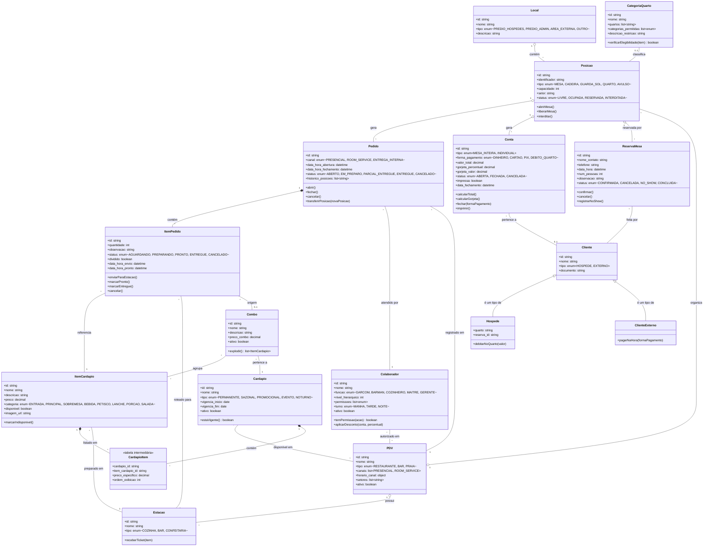

# 1.2 — Diagrama de Classes UML: App Restaurante HiHotel

> **Módulo:** 1.2 — Diagrama de Classes (UML)
> **Data:** 2026-04-05
> **Base:** Modelo de entidades do módulo 1.1 (14 entidades, 23 decisões)

---

## Diagrama Completo (Mermaid)

> **Como visualizar:** Cole o bloco abaixo em [mermaid.live](https://mermaid.live)
> ou visualize direto no GitHub (suporta Mermaid nativo em Markdown).



---

## Legenda UML

### Tipos de Linha (Relacionamentos)

| Símbolo | Nome | Significado | Exemplo no diagrama |
|---------|------|-------------|---------------------|
| `──` | Associação | "Conhece / usa" | Pedido → Colaborador |
| `*──` | Composição | "Faz parte e não existe sem" | Pedido ◆→ ItemPedido |
| `o──` | Agregação | "Faz parte mas pode existir sozinho" | PDV ◇→ Posição |
| `<\|──` | Herança | "É um tipo de" | Cliente ◁── Hóspede |
| `──` (tracejado) | Dependência | "Usa temporariamente" | (não usado aqui) |

### Multiplicidade (números nas pontas)

| Notação | Significado | Exemplo |
|---------|-------------|---------|
| `1` | Exatamente um | Um Pedido tem exatamente 1 Colaborador |
| `0..1` | Zero ou um (opcional) | Uma Conta pode ter 0 ou 1 Cliente |
| `*` | Zero ou mais | Um PDV tem zero ou mais Posições |
| `1..*` | Um ou mais | Um Pedido tem 1 ou mais ItemPedido |

### Seções de uma Classe

```
┌─────────────────────┐
│    Nome da Classe    │  ← identifica a entidade
├─────────────────────┤
│  + atributo: tipo    │  ← dados que ela armazena
│  - privado: tipo     │  ← dado interno (não exposto)
├─────────────────────┤
│  + metodo()          │  ← ações que ela executa
│  + metodo(): retorno │  ← ação com retorno
└─────────────────────┘
```

O `+` significa público (qualquer um acessa), `-` privado (só interno).

---

## Decisões de Modelagem nos Métodos

### Por que métodos importam pro fundador

No módulo 1.1, você definiu "o que existe" (entidades e atributos).
Agora, os métodos definem "o que acontece" — e cada método é uma
**regra de negócio** que você define como dono de produto.

| Método | Classe | Regra de negócio que ele codifica |
|--------|--------|----------------------------------|
| `transferirPosicao()` | Pedido | "Cliente pode mudar de mesa e levar o pedido" |
| `aplicarDesconto()` | Colaborador | "Só nível 3+ pode dar desconto" |
| `verificarElegibilidade()` | CategoriaQuarto | "Quarto 25 não pode pedir prato principal" |
| `explodir()` | Combo | "Combo vira tickets separados na cozinha" |
| `debitarNoQuarto()` | Hospede | "Hóspede pode jogar consumo pra conta do quarto" |
| `temPermissao()` | Colaborador | "Verificar se o nível hierárquico permite a ação" |
| `calcularGorjeta()` | Conta | "10% fixo sobre o total da conta" |
| `imprimir()` | Conta | "Enviar pra impressora térmica via rede local" |
| `registrarNoShow()` | ReservaMesa | "Liberar mesa se cliente não apareceu" |
| `marcarPronto()` | ItemPedido | "Cozinha/bar sinalizou que o item está pronto" |

### A tabela intermediária (CardápioItem)

```
Cardápio ──── CardápioItem ──── ItemCardápio
             │ preco_especifico │
             │ ordem_exibicao   │
```

Quando a relação é N:N (um item pode estar em vários cardápios,
um cardápio tem vários itens), UML resolve com uma **classe associativa**
— uma tabela intermediária que guarda atributos próprios da relação.

Aqui, o mesmo filé pode custar R$89,90 no cardápio permanente
e R$69,90 no combo de Natal. O preço não é do item — é da relação
item-cardápio. Por isso `preco_especifico` fica na CardápioItem.

---

## Organização em Camadas

O diagrama está organizado em **5 camadas conceituais**.
Isso não é UML formal — é uma escolha de organização pra facilitar a leitura.

```
┌─────────────────────────────────────────────┐
│  CAMADA ESPACIAL                            │
│  Local, PDV, Posição, CategoriaQuarto       │
│  "Onde as coisas acontecem"                 │
├─────────────────────────────────────────────┤
│  CAMADA DE CARDÁPIO                         │
│  Cardápio, ItemCardápio, Combo, CardápioItem│
│  "O que pode ser pedido"                    │
├─────────────────────────────────────────────┤
│  CAMADA DE PREPARO                          │
│  Estação                                    │
│  "Onde os itens são feitos"                 │
├─────────────────────────────────────────────┤
│  CAMADA DE PEDIDO                           │
│  Pedido, ItemPedido                         │
│  "O fluxo principal"                        │
├─────────────────────────────────────────────┤
│  CAMADA FINANCEIRA          CAMADA PESSOAS  │
│  Conta                      Cliente         │
│  "Como se paga"             Hóspede         │
│                             ClienteExterno  │
│                             Colaborador     │
│                             ReservaMesa     │
│                             "Quem participa"│
└─────────────────────────────────────────────┘
```

Essa organização em camadas é um preview do módulo 2.1
(Camadas e Responsabilidades). Aqui é conceitual;
lá vai ser técnico (frontend, backend, banco).

---

## CardápioItem: Entidade Nova (15a entidade)

O módulo 1.1 mencionou "tabela intermediária" mas não a formalizou.
Agora ela é explícita:

| Atributo | Tipo | Exemplo |
|----------|------|---------|
| cardapio_id | referência → Cardápio | card_001 |
| item_cardapio_id | referência → ItemCardápio | item_001 |
| preco_especifico | decimal | 69.90 (null = usa preço padrão do item) |
| ordem_exibicao | int | 3 (posição no cardápio) |

**Por que existe:** Resolve o N:N entre Cardápio e ItemCardápio
e permite que o mesmo item tenha preço diferente em cardápios diferentes.

---

## Conceitos Aprendidos neste Módulo

| Conceito | Definição | Exemplo neste diagrama |
|----------|-----------|----------------------|
| **Classe UML** | Caixa com nome, atributos e métodos | Pedido com status + abrir() |
| **Método** | Ação que uma entidade executa (regra de negócio) | transferirPosicao(), aplicarDesconto() |
| **Composição (◆)** | "Não existe sem" — parte morre com o todo | ItemPedido não existe sem Pedido |
| **Agregação (◇)** | "Faz parte mas existe sozinho" | Colaborador existe sem PDV |
| **Herança (◁)** | Especialização — subtipo herda tudo do pai | Hóspede herda tudo de Cliente + adiciona quarto |
| **Classe associativa** | Tabela intermediária com atributos próprios | CardápioItem (preço específico por cardápio) |
| **Multiplicidade** | Quantos de cada lado (1, 0..1, *, 1..*) | Pedido 1 ──── * ItemPedido |
| **Visibilidade (+/-)** | Público vs privado | + público (acessível), - privado (interno) |
| **Camadas conceituais** | Agrupar classes por responsabilidade | Espacial, Cardápio, Pedido, Financeiro, Pessoas |
| **Mermaid** | Ferramenta pra renderizar diagramas UML em texto | Bloco de código renderizável no GitHub |

## Vocabulário acumulado (módulos 1.1 + 1.2)

| Termo | Módulo | Use com Matheus quando... |
|-------|--------|--------------------------|
| Entidade | 1.1 | "As entidades do domínio são..." |
| Cardinalidade | 1.1 | "A relação Mesa-Pedido é 1:N" |
| Generalização | 1.1 | "Posição generaliza Mesa, Cadeira, Quarto" |
| Regra de Elegibilidade | 1.1 | "Quartos 8–33 têm elegibilidade restrita" |
| Classe | 1.2 | "A classe Pedido tem esses métodos" |
| Composição | 1.2 | "ItemPedido é composição do Pedido" |
| Agregação | 1.2 | "Colaborador é agregação do PDV" |
| Herança | 1.2 | "Hóspede herda de Cliente" |
| Classe associativa | 1.2 | "CardápioItem é a classe associativa entre Cardápio e Item" |
| Método | 1.2 | "O método verificarElegibilidade() filtra o cardápio por quarto" |
