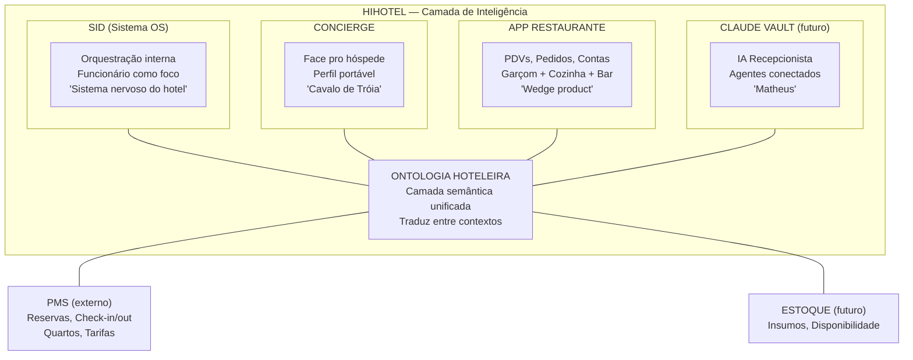

# 1.3 — Glossário e Mapa de Contextos: HiHotel

> **Módulo:** 1.3 — DDD: Linguagem e Contextos
> **Data:** 2026-04-05
> **Base:** Entidades (1.1), Diagrama de Classes (1.2), Ontologia HiHotel (sessão 2026-03-31)

---

## Mapa de Bounded Contexts

A HiHotel tem (e terá) múltiplos sistemas. Cada um é um **Bounded Context**
— um território onde os termos têm significado preciso e as regras são próprias.



### Regra fundamental dos Bounded Contexts

**Cada contexto é dono dos seus dados.** O App Restaurante não acessa a tabela
de funcionários do SID. Se precisa saber o nome do garçom, pede à ontologia (ou
via API). Isso é o que garante que cada sistema pode evoluir independentemente.

Quando o Matheus fala "módulos desconectados", é exatamente isso que a ontologia
resolve: ela é a **ponte** entre contextos, sem que eles dependam diretamente
um do outro.

---

## Como o mesmo conceito muda entre contextos

Esta é a tabela mais importante deste artefato. Ela mostra por que vocês
PRECISAM de Bounded Contexts — a mesma palavra significa coisas diferentes
em cada sistema.

### Pessoa (Hóspede / Funcionário)

| Atributo | SID | Concierge | App Restaurante | PMS |
|----------|-----|-----------|-----------------|-----|
| O que é | Colaborador do hotel | Hóspede com perfil portável | Cliente que consome | Hóspede com reserva |
| Identidade | ID interno + cargo + nível | Perfil entre hotéis | nome + tipo (hóspede/externo) | ID de reserva |
| O que importa | Desempenho, aprendizado, pontos | Preferências, histórico, idioma | Quarto (pra debitar), documento (pra nota) | Datas, tarifa, quarto |
| Dados exclusivos | Avaliações, treinamentos, gamificação | Restrições alimentares, idioma | Conta, pedidos, gorjeta | Tarifário, pagamentos |
| Verbo HiHotel | APRENDER, ENSINAR, RECONHECER | CONECTAR, LEMBRAR | COORDENAR | — (externo) |

### Quarto

| Atributo | SID | Concierge | App Restaurante | PMS |
|----------|-----|-----------|-----------------|-----|
| O que é | Local de trabalho (governança, manutenção) | Local de estadia do hóspede | Destino de room service | Unidade de inventário |
| O que importa | Status de limpeza, OS pendentes | Preferências do hóspede naquele quarto | Categoria (elegibilidade de cardápio) | Disponibilidade, tarifa, ocupação |
| Dados exclusivos | Checklist de limpeza, tempo | Controle de temperatura, TV | CategoriaQuarto (1–7 vs 8–33) | Revenue, rate codes |

### Pedido / Ordem

| Atributo | SID | App Restaurante |
|----------|-----|-----------------|
| O que é | Ordem de Serviço (OS) — tarefa pra equipe | Pedido de consumo — itens pra cozinha/bar |
| O que importa | Quem executa, prazo, prioridade | Itens, preço, estação de preparo |
| Status possíveis | Aberta, Em andamento, Concluída | Aberto, Em preparo, Entregue |
| Destino | Equipe/funcionário | Cozinha/Bar (Estação) |

> **Esse é o perigo de não ter Bounded Contexts:** Se alguém diz "pedido" numa
> reunião, pode estar falando de Ordem de Serviço (SID) ou Pedido de consumo
> (Restaurante). O glossário abaixo resolve isso.

---

## Glossário — Ubiquitous Language da HiHotel

### Termos Globais (valem em todos os contextos)

| Termo | Definição | NÃO confundir com |
|-------|-----------|-------------------|
| **Hotel** | Estabelecimento cliente da HiHotel | A empresa HiHotel em si |
| **Complexo** | Conjunto de prédios e áreas de um hotel | Um único prédio |
| **Ontologia** | Modelo semântico que unifica dados entre sistemas | Banco de dados (ontologia é conceitual, banco é técnico) |
| **Verbo HiHotel** | Ação humana fundamental que os sistemas habilitam | Endpoint de API ou função de código |

### Verbos da HiHotel (camada semântica)

| Verbo | Definição | Contexto principal | Exemplo concreto |
|-------|-----------|-------------------|------------------|
| **APRENDER** | Adquirir conhecimento operacional | SID | Funcionário completa treinamento de drinks |
| **ENSINAR** | Transferir conhecimento entre pessoas | SID | Barman ensina novo drink pro cumin |
| **COORDENAR** | Orquestrar ações entre pessoas/sistemas | SID + Restaurante | Garçom registra pedido → cozinha recebe ticket |
| **ELEVAR** | Melhorar desempenho ou qualidade | SID | Funcionário sobe de nível por avaliações |
| **RECONHECER** | Dar visibilidade a contribuições | SID | Hóspede avalia → funcionário ganha pontos |
| **CONECTAR** | Unir informação de fontes diferentes | Concierge + Ontologia | Perfil do hóspede conecta preferências com oferta do hotel |
| **TRADUZIR** | Converter dados entre formatos/contextos | Ontologia | Reserva do PMS → dados que o Concierge entende |
| **LEMBRAR** | Persistir e recuperar informação relevante | Concierge | "Este hóspede pediu almofada extra na última estadia" |

> **Por que verbos e não features:** Features mudam, verbos permanecem.
> "Notificação push pro garçom" é uma feature que implementa COORDENAR.
> "Quiz de onboarding" é uma feature que implementa APRENDER.
> Os verbos são estáveis — as features são implementações que podem mudar.

### Termos do Contexto: App Restaurante

| Termo | Definição | NÃO confundir com |
|-------|-----------|-------------------|
| **PDV** | Ponto de Venda — local organizado para consumo com equipe e cardápio próprio | Local (que é qualquer ponto do complexo) |
| **Posição** | Ponto específico de consumo (mesa, cadeira, guarda-sol, quarto) | Mesa (que é só um tipo de posição) |
| **Canal** | Modo de atendimento dentro de um PDV (presencial, room service, entrega interna) | PDV (canal opera DENTRO de um PDV) |
| **Pedido** | Solicitação de itens de consumo feita numa posição. É a comanda digital. | Ordem de Serviço do SID |
| **ItemPedido** | Um item específico dentro de um pedido. Vira ticket na estação. | ItemCardápio (que é a definição no menu, não o pedido concreto) |
| **Ticket** | Representação de um ItemPedido na visão da estação (cozinha/bar) | Pedido inteiro (ticket é um item, não o pedido todo) |
| **Estação** | Local de preparo que recebe tickets (cozinha, bar, confeitaria) | PDV (estação é onde se prepara, PDV é onde se consome) |
| **Conta** | Registro financeiro de um consumo, por mesa ou por pessoa | Pedido (um pedido gera itens na conta, mas conta ≠ pedido) |
| **Combo** | Agrupamento de itens com preço único que "explode" em tickets individuais | Desconto (combo é preço fixo, desconto é redução percentual) |
| **CategoriaQuarto** | Classificação que define elegibilidade de room service | Tipo de quarto no PMS (que é sobre tarifa, não sobre cardápio) |
| **Entrega Interna** | Pedido pra local fora dos PDVs (sala reunião, quarto admin) | Room Service (que é entrega em quarto de hóspede) |

### Termos do Contexto: SID

| Termo | Definição | NÃO confundir com |
|-------|-----------|-------------------|
| **Ordem de Serviço (OS)** | Tarefa atribuída a um colaborador ou equipe | Pedido do restaurante |
| **Colaborador** | Funcionário do hotel que usa o sistema | Cliente do restaurante |
| **Avaliação** | Feedback sobre desempenho de um colaborador | Review de código ou avaliação de hóspede |
| **Pontos** | Unidade de gamificação por desempenho | Dinheiro ou desconto |

### Termos do Contexto: Concierge

| Termo | Definição | NÃO confundir com |
|-------|-----------|-------------------|
| **Perfil** | Conjunto portável de preferências e histórico do hóspede entre hotéis | Cadastro no PMS (que é por reserva, não por pessoa) |
| **Preferência** | Informação sobre gosto/necessidade do hóspede | Pedido (preferência é permanente, pedido é pontual) |
| **Estadia** | Período em que o hóspede está no hotel (com contexto rico) | Reserva no PMS (que é sobre datas e tarifas) |

---

## Aggregates do App Restaurante

Grupos de entidades que formam unidades coesas.
A **raiz** é o ponto de entrada — toda operação passa por ela.

### Aggregate: Pedido

```
PEDIDO (raiz)
├── ItemPedido 1  → Estação: Cozinha
├── ItemPedido 2  → Estação: Bar
└── ItemPedido 3  → Estação: Cozinha (de Combo)
```

**Regras do aggregate:**
- Adicionar item: só se pedido.status = ABERTO
- Cancelar item: só se colaborador.temPermissao(CANCELAR_ITEM)
- Fechar pedido: só quando todos os itens estão ENTREGUE ou CANCELADO
- Transferir posição: permitido em qualquer status exceto CANCELADO

**Invariante:** A soma dos itens do pedido deve bater com os tickets
nas estações. Se tem 3 ItemPedido, tem que ter 3 tickets (um por estação).

### Aggregate: Conta

```
CONTA (raiz)
├── referência aos pedidos da posição
├── cálculo de valor total
├── cálculo de gorjeta (10%)
└── forma de pagamento
```

**Regras do aggregate:**
- Fechar conta: só se todos os pedidos da posição estão fechados
- Débito em quarto: só se cliente.tipo = HOSPEDE
- Aplicar desconto: só se colaborador.nivel >= 3
- Reimprimir: permitido, mas campo `impressa` deve ser true

### Aggregate: Cardápio

```
CARDÁPIO (raiz)
├── CardápioItem 1 → ItemCardápio (preço específico)
├── CardápioItem 2 → ItemCardápio
├── Combo 1 → [ItemCardápio, ItemCardápio]
└── ...
```

**Regras do aggregate:**
- Ativar cardápio: verifica vigência (início/fim)
- Item indisponível: marca ItemCardápio.disponivel = false (não remove do cardápio)
- Preço do combo: fixo, independente dos preços individuais dos itens

### Aggregate: Posição

```
POSIÇÃO (raiz)
├── status (LIVRE, OCUPADA, RESERVADA, INTERDITADA)
├── referência ao PDV (ou null se AVULSO)
├── referência ao Local
└── CategoriaQuarto (se tipo = QUARTO)
```

**Regras do aggregate:**
- Ocupar: só se status = LIVRE ou RESERVADA (no horário)
- Liberar: só se todas as contas estão fechadas
- Reservar: verifica conflito de horário com outras reservas

---

## Entity vs Value Object no App Restaurante

| Conceito | Tipo | Justificativa |
|----------|------|---------------|
| Pedido | **Entity** | Pedido #001 ≠ #002, mesmo com mesmos itens |
| ItemPedido | **Entity** | Cada item tem ciclo de vida próprio (status muda) |
| Conta | **Entity** | Conta #001 ≠ #002, tem estado que muda |
| Cliente | **Entity** | João ≠ Maria, mesmo que ambos sejam hóspedes |
| Colaborador | **Entity** | Stella ≠ Pedro, identidade importa |
| Posição | **Entity** | Mesa 7 ≠ Mesa 12, tem status próprio |
| PDV | **Entity** | Restaurante ≠ Bar, configurações diferentes |
| Observação ("sem cebola") | **Value Object** | É só texto, sem identidade |
| Preço (R$89,90) | **Value Object** | É um valor, não tem ID |
| Período de vigência | **Value Object** | "jan–mar" é só um intervalo |
| Gorjeta (10%) | **Value Object** | É um cálculo, não uma entidade |
| Endereço do hotel | **Value Object** | É descritivo, não muda por pedido |
| Histórico de posições | **Value Object** | É uma lista de referências, sem identidade própria |

> **Regra prática:** Se você precisa dizer "ESTE específico" (este pedido,
> esta conta, este garçom), é Entity. Se você pode trocar por outro igual
> e ninguém percebe (R$89,90 é R$89,90), é Value Object.

---

## Como a Ontologia Traduz Entre Contextos

```
App Restaurante                    SID
     │                              │
     │ "Cliente do quarto 204       │ "Colaborador Stella
     │  pediu filé no room service" │  completou treinamento"
     │                              │
     ▼                              ▼
┌──────────────────────────────────────┐
│         ONTOLOGIA HOTELEIRA          │
│                                      │
│  Pessoa: "João Silva"                │
│  ├── no Restaurante: Cliente #042    │
│  ├── no Concierge: Perfil #789       │
│  └── no PMS: Reserva #12345         │
│                                      │
│  Pessoa: "Stella Santos"             │
│  ├── no Restaurante: Colaborador #03 │
│  ├── no SID: Colaborador #03         │
│  └── (mesma pessoa, contextos        │
│       diferentes)                    │
│                                      │
│  Verbo: COORDENAR                    │
│  ├── no Restaurante: pedido → ticket │
│  └── no SID: OS → execução           │
└──────────────────────────────────────┘
```

A ontologia não duplica dados. Ela **mapeia** como a mesma entidade
do mundo real (uma pessoa, um espaço, uma ação) aparece em cada contexto.

Isso é o que torna possível o "conectar com qualquer PMS": o PMS muda,
mas a ontologia traduz. O App Restaurante nunca precisa saber qual PMS
está por trás — ele fala com a ontologia.

---

## Anti-Patterns: O Que NÃO Fazer

| Anti-pattern | Por quê é ruim | O que fazer |
|--------------|---------------|-------------|
| **"God Object"** — uma entidade Hóspede com 50 campos que serve todos os sistemas | Cada mudança num sistema quebra os outros | Bounded Contexts com entidades específicas |
| **Acesso direto entre contextos** — App Restaurante acessando tabela do SID | Acoplamento — se o SID muda o schema, restaurante quebra | Comunicar via API/ontologia |
| **Mesmo termo, definição vaga** — "pedido" sem qualificar | Ambiguidade em reuniões e no código | Glossário: "Pedido (Restaurante)" vs "OS (SID)" |
| **Agregar tudo** — um aggregate gigante com Pedido + Conta + Mesa + Cliente | Performance ruim, regras confusas | Aggregates pequenos e focados |

---

## Conceitos Aprendidos neste Módulo

| Conceito | Definição | Exemplo neste artefato |
|----------|-----------|----------------------|
| **Ubiquitous Language** | Vocabulário único onde cada termo tem definição precisa | Glossário HiHotel |
| **Bounded Context** | Território onde termos têm significado próprio | SID vs Restaurante vs Concierge |
| **Entity** | Tem identidade — "ESTE específico" | Pedido #001 |
| **Value Object** | Definido pelo valor, sem identidade | R$89,90, "sem cebola" |
| **Aggregate** | Grupo de entidades tratado como unidade | Pedido + ItemPedido |
| **Aggregate Root** | Ponto de entrada do aggregate | Pedido é raiz, ItemPedido é filho |
| **Invariante** | Regra que o aggregate garante sempre | "Soma dos itens = soma dos tickets" |
| **Anti-pattern** | Padrão reconhecidamente ruim | God Object, acesso direto entre contextos |
| **Classe associativa** (reforço 1.2) | Tabela que resolve N:N com dados próprios | CardápioItem |

## Vocabulário acumulado (módulos 1.1 + 1.2 + 1.3)

| Termo | Módulo | Use com Matheus quando... |
|-------|--------|--------------------------|
| Entidade | 1.1 | "As entidades do domínio são..." |
| Cardinalidade | 1.1 | "A relação Mesa-Pedido é 1:N" |
| Generalização | 1.1 | "Posição generaliza Mesa, Cadeira, Quarto" |
| Regra de Elegibilidade | 1.1 | "Quartos 8–33 têm elegibilidade restrita" |
| Classe | 1.2 | "A classe Pedido tem esses métodos" |
| Composição | 1.2 | "ItemPedido é composição do Pedido" |
| Herança | 1.2 | "Hóspede herda de Cliente" |
| Classe associativa | 1.2 | "CardápioItem é a classe associativa entre Cardápio e Item" |
| Método | 1.2 | "O método verificarElegibilidade() filtra o cardápio" |
| Ubiquitous Language | 1.3 | "Precisamos alinhar o glossário — 'pedido' é ambíguo" |
| Bounded Context | 1.3 | "O Restaurante e o SID são contextos diferentes" |
| Aggregate | 1.3 | "Pedido é aggregate root, ItemPedido é filho" |
| Entity vs Value Object | 1.3 | "Observação é Value Object, não precisa de tabela" |
| Invariante | 1.3 | "A invariante é: todo ItemPedido gera um ticket" |
| Anti-pattern | 1.3 | "Hóspede com 50 campos é God Object, vamos separar" |
