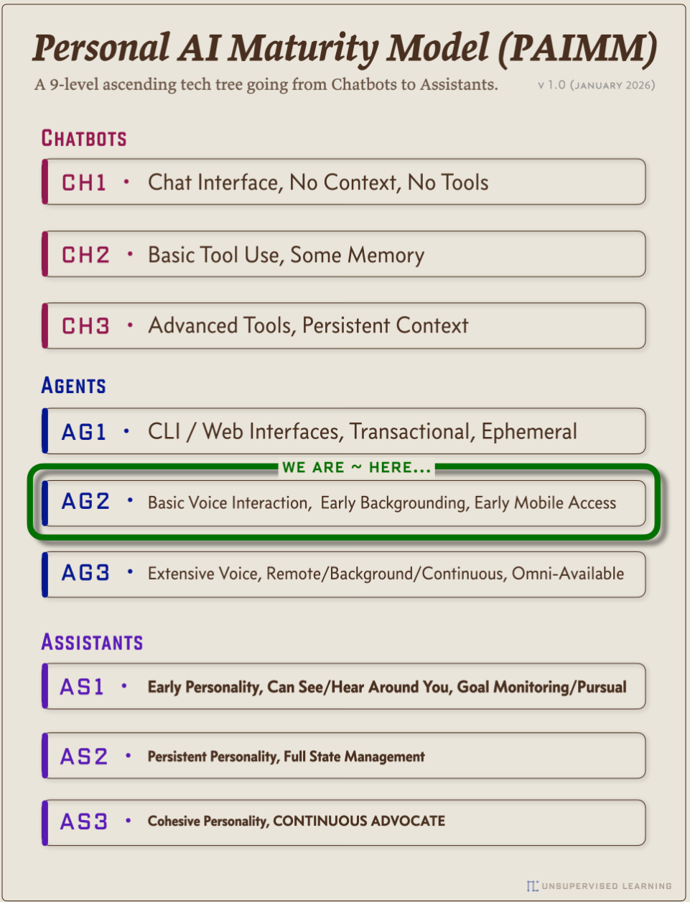
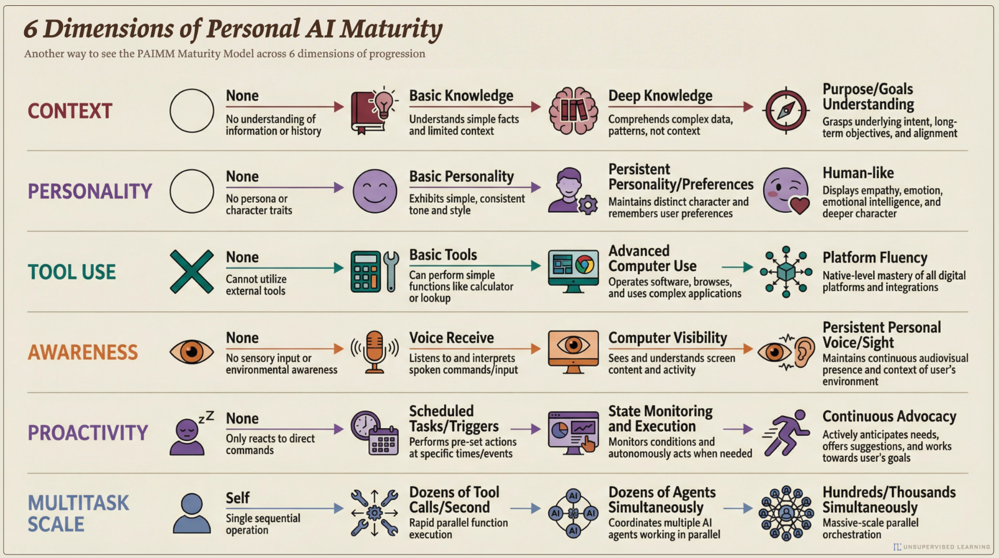
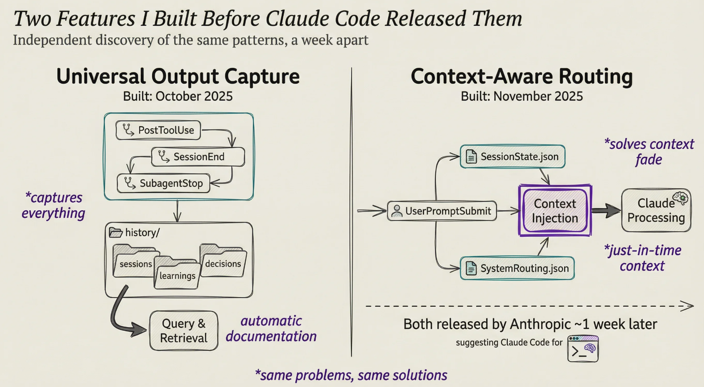
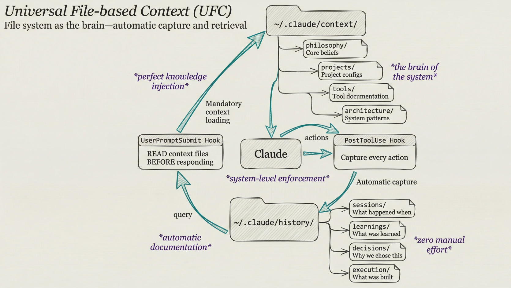
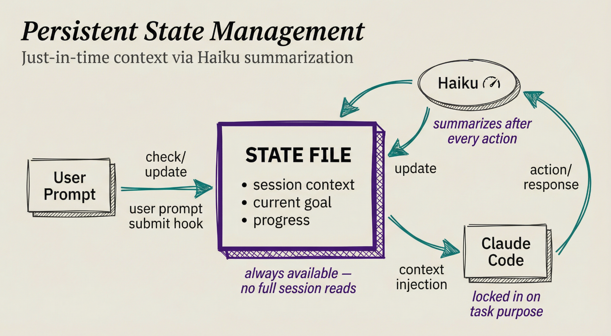

# Personal AI Maturity Model (PAIMM)

## Fonte
- **Tipo:** artigo
- **Autor:** Daniel Miessler / Unsupervised Learning
- **URL:** https://danielmiessler.com/blog/personal-ai-maturity-model
- **Data original:** Janeiro 2026
- **Data captura:** 2026-01-11

## Conteúdo

### Core Premise

Rather than predicting unpredictable futures, Miessler argues we can "predict what we'll want" by examining eternal human desires—safety, connection, capability. This backward-mapping approach reveals the likely trajectory of personal AI development.

### PAIMM: 9 Níveis em 3 Eras



**A 9-level ascending tech tree going from Chatbots to Assistants.** (v1.0 January 2026)

---

## Era 1: CHATBOTS (2022-2024)

| Level | Nome | Descrição |
|-------|------|-----------|
| **CH1** | Chat Interface | No Context, No Tools |
| **CH2** | Basic Tool Use | Some Memory |
| **CH3** | Advanced Tools | Persistent Context |

Simple Q&A interfaces with minimal context about users. Early versions had no tools; later iterations added memory and basic capabilities, though agents remained experimental.

---

## Era 2: AGENTS (Late 2024 onward)

| Level | Nome | Descrição |
|-------|------|-----------|
| **AG1** | CLI / Web Interfaces | Transactional, Ephemeral |
| **AG2** | Basic Voice Interaction | Early Backgrounding, Early Mobile Access |
| **AG3** | Extensive Voice | Remote/Background/Continuous, Omni-Available |

> **"WE ARE ~ HERE..."** - AG2 (Janeiro 2026)

Autonomous workers handling tasks independently. Tools become "controllable and deterministic." Voice interfaces expand. Background execution becomes possible alongside cloud integration.

---

## Era 3: ASSISTANTS (2026+)

| Level | Nome | Descrição |
|-------|------|-----------|
| **AS1** | Early Personality | Can See/Hear Around You, Goal Monitoring/Pursual |
| **AS2** | Persistent Personality | Full State Management |
| **AS3** | Cohesive Personality | **CONTINUOUS ADVOCATE** |

Named, trusted companions working proactively toward your goals. They understand context including your objectives, challenges, and metrics. They function as advocates rather than reactive helpers, monitoring system states and planning accordingly.

---

## 6 Dimensions of Personal AI Maturity



| Dimension | Básico → Avançado |
|-----------|-------------------|
| **CONTEXT** | None → Basic Knowledge → Deep Knowledge → Purpose/Goals |
| **PERSONALITY** | None → Basic Personality → Persistent Personality/Preferences → Human-like |
| **TOOL USE** | None → Basic Tools → Advanced Computer Use → Platform Fluency |
| **AWARENESS** | None → Voice Receive → Computer Visibility → Persistent Personal Voice/Sight |
| **PROACTIVITY** | None → Scheduler Triggers → State Monitoring → Continuous Advocacy |
| **MULTITASK SCALE** | Self → Dozens of Tool Calls/Second → Dozens of Agents Simultaneously → Hundreds/Thousands Simultaneously |

---

## AS3 Characteristics (Ultimate Vision)

The endpoint features:
- **Continuous, tireless advocacy** scanning for opportunities and threats
- **Full computer access** with screen/audio visibility
- **Environmental customization** (lighting, temperature, ambient settings)
- **Enhanced perception** through available camera networks
- **Message filtering** and real-time fact-checking
- **Deep personal understanding** developed over time

---

## Practical Applications

Examples span:
- **Lifestyle management** (optimizing morning routines)
- **Professional advancement** (tracking promotion-relevant work)
- **Team leadership** (monitoring employee utilization)
- **Crisis prevention** (detecting elder care emergencies)

The model emphasizes that such power requires addressing serious risks including system compromise, manipulation, and potential government overreach.

---

## Arquitetura PAI (Slides Relacionados)

### Two Features Built Before Claude Code Released Them


**Independent discovery of the same patterns, a week apart:**

| Universal Output Capture | Context-Aware Routing |
|--------------------------|----------------------|
| Built: October 2025 | Built: November 2025 |
| PostToolUse, SessionEnd, SubagentStop | SessionState.json |
| *"captures everything"* | *"solves context fade"* |
| → history/ (sessions, learnings, decisions) | Context Injection → Claude Processing |
| → Query & Retrieval | *"just-in-time context"* |
| **automatic documentation** | SystemRouting.json |

> *"Both released by Anthropic ~1 week later"*
> *"same problems, same solutions"*

---

### Universal File-based Context (UFC)


**File system as the brain—automatic capture and retrieval**

```
~/.claude/context/
├── philosophy/     ← Core beliefs
├── projects/       ← Project configs  ("the brain of the system")
├── tools/          ← Tool documentation
└── architecture/   ← System patterns

~/.claude/history/
├── sessions/       ← What happened
├── learnings/      ← What was learned
├── decisions/      ← What was decided  ("zero manual effort")
└── execution/      ← What was built
```

**Flow:**
1. UserPromptSubmit Hook → READ context files BEFORE responding (*"perfect knowledge injection"*)
2. Claude processes with mandatory context loading (*"system-level enforcement"*)
3. PostToolUse Hook → Capture every action (*"Automatic capture"*)
4. → Write to ~/.claude/history/ (*"automatic documentation"*)

---

### Persistent State Management


**Just-in-time context via Haiku summarization**

**Flow:**
1. **User Prompt** → check/update via user prompt submit hook
2. **STATE FILE** contains:
   - session context
   - current goal
   - progress
   - *"always available — no full session reads"*
3. **Haiku** summarizes after every action
4. **Claude Code** receives context injection → *"locked in on task purpose"*

---

## Minhas Anotações

### Diferença entre AIMM e PAIMM

| AIMM (5 níveis) | PAIMM (9 níveis) |
|-----------------|------------------|
| Foco em trabalho/organizações | Foco em assistência pessoal |
| Natural → Managed | Chatbots → Agents → Assistants |
| Macro (mercado de trabalho) | Micro (indivíduo) |

### Key Insight

> "WE ARE ~ HERE..." - Estamos no AG2 (Basic Voice Interaction, Early Backgrounding, Early Mobile Access)

O objetivo final é **AS3: Continuous Advocate** - uma IA que atua proativamente em seu favor 24/7.

